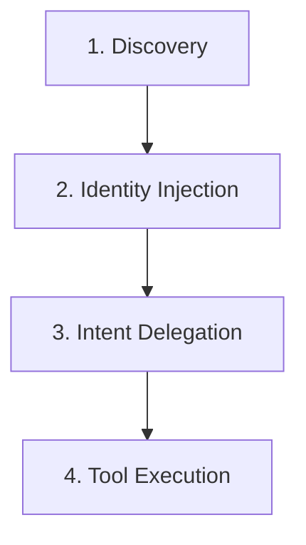

# Chapter 1: ADK Developer Overview & Lifecycle

Welcome to the custom **Hubscape Agent Development Kit (ADK) Guide**. This chapter introduces you to the core ADK lifecycle, the onboarding journey, and how custom agents integrate into the Hubscape host platform.

---

## 1. Introduction to the ADK

The Hubscape Modular ADK allows developers to quickly build, deploy, and scale custom AI agents using a package-based declarative Python framework. 

Rather than building full monolithic web applications, developers write:
1. **Prompts (`SKILL.md`)** to specify the agent's instructions.
2. **Python Scripts (`app/scripts/`)** to implement functional tools that the agent's LLM can invoke.
3. **UI Layout templates (`app/ui/widgets/`)** to render interactive Lego widgets in the user chat interface.

---

## 2. The Agent Lifecycle

The platform engine manages the agent lifecycle in four distinct phases:



1. **Discovery:** At boot time, the Hubscape loader scans the registered agent directories for configurations and initialization files (e.g. `app/agent.py`).
2. **Identity Injection:** The agent's metadata, name, and description (defined in `agent.py`) are extracted and dynamically appended to the central Hubscape Host AI prompt as a routed skill capability.
3. **Intent Delegation:** When a user enters a query, the Host AI uses the capability descriptions to analyze user intent. If the query aligns with your agent's description, the Host automatically delegates the thread to your agent.
4. **Tool Execution:** Your agent is booted within a secure sandboxed container. The agent's LLM interprets the query using instructions from `app/SKILL.md` and executes individual Python functions (tools) from `app/scripts/` to solve the task.

---

## 3. The Developer Journey (Onboarding SOP)

To get started developing a custom agent:

1. **CLI Installation:** Install the `hubscape-adk` studio tools globally using `pipx`:
   ```bash
   pipx install git+https://github.com/Zco-AI-Labs/Hubscape-ADK-Studio.git
   ```
2. **Obtain Sandbox Credentials:** Request a Personal Access Token (PAT), a unique Agent UUID, and a Deployment Token from your Organization Administrator.
3. **Bootstrap Repo:** Click "Use this template" on the template repository and clone it:
   ```bash
   hubscape-adk clone https://github.com/YourOrg/your-agent-repo
   ```
4. **Start local Holodeck:** Launch the local sandbox dashboard:
   ```bash
   hubscape-adk
   ```
   Open **http://localhost:8090** to talk to your local mock agent, run unit/integration tests, and debug tool execution safely using local mock resources.

---

[Next Chapter: Directory Specification & Ingestion Pipeline](CHAPTER_2_DIRECTORY_SPECIFICATION.md)
